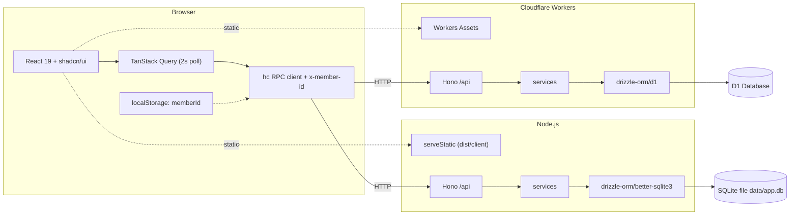
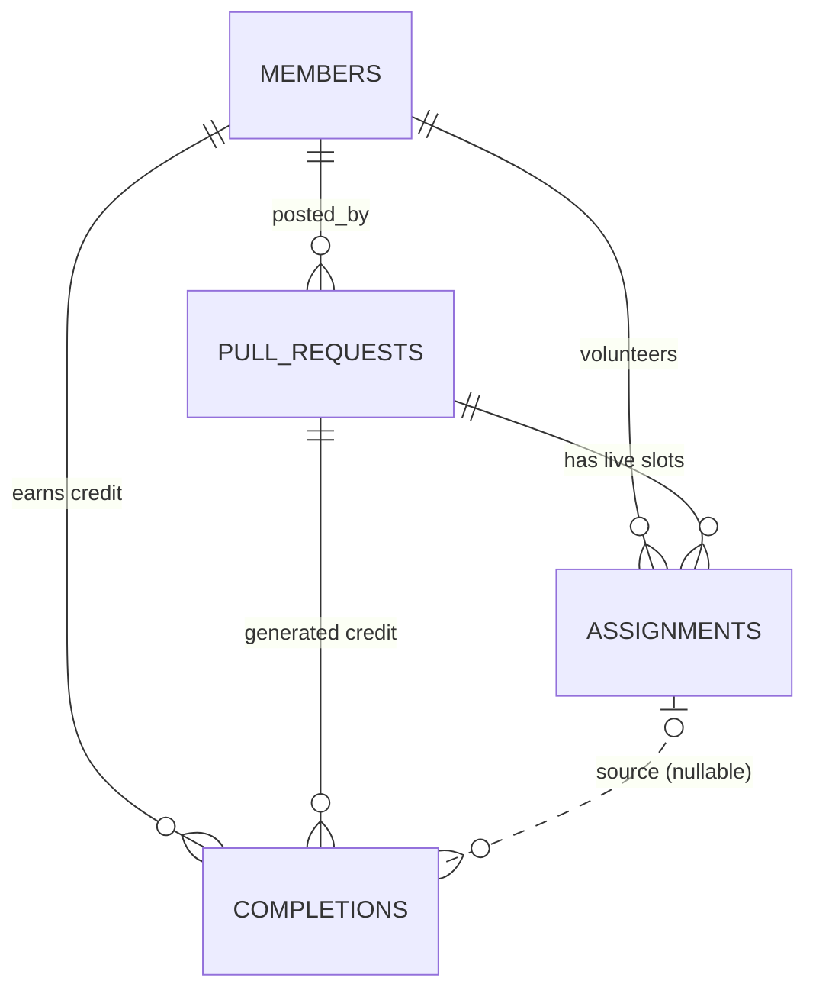
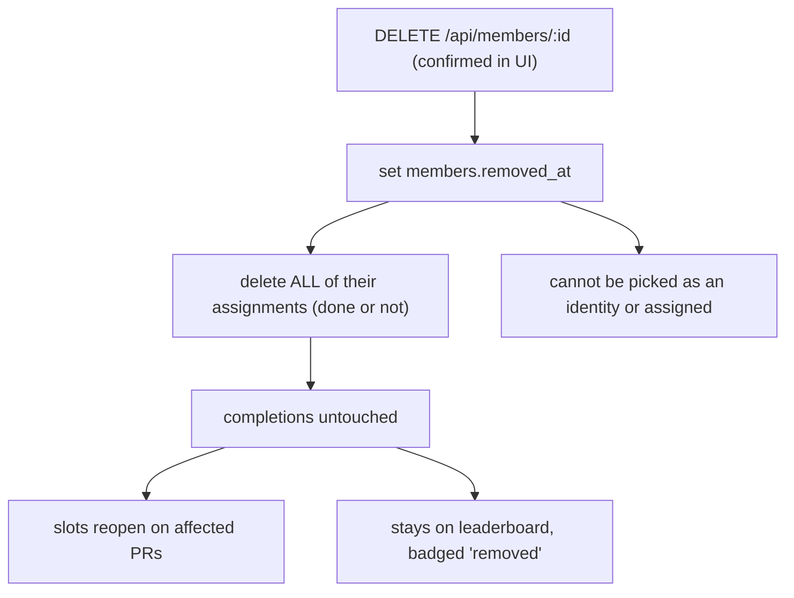

# Wechsel - Architecture

Companion to [product.md](product.md). This describes how the app is built and why.

## 1. Stack

- **Language:** TypeScript everywhere, `strict: true` (required for Hono's RPC type inference to work).
- **Runtime:** Platform-adaptive — runs on Cloudflare Workers (D1) or Node.js (file-based SQLite). A thin platform adapter in `src/server/platforms/` selects the runtime; all application code is platform-agnostic.
- **Backend:** [Hono](https://hono.dev), with `@hono/zod-validator` for request validation. Runs identically on both runtimes.
- **Database:** SQLite via **Drizzle ORM**. Cloudflare D1 in production Workers; `better-sqlite3` for Node.js and tests. Same schema, same queries, different drivers.
- **Frontend:** React 19 + Vite, **Tailwind CSS v4** (via `@tailwindcss/vite`) and **shadcn/ui** components.
- **Data fetching:** TanStack Query over Hono's `hc` RPC client, so the frontend gets end-to-end types with no code generation and no OpenAPI step.
- **Validation:** Zod schemas defined once in `src/shared` and used by both the server validators and the client forms.
- **Tests:** Vitest. Server tests drive the Hono app in-process via `app.request()` against a fresh in-memory `better-sqlite3` database.
- **Deploy:** Cloudflare (`wrangler deploy`) or Node.js (`pnpm build && pnpm start:node`).

### Why these choices

- **Platform adapters over a single fixed runtime.** The `createApp(db)` pattern accepts any compatible Drizzle instance, so the same application code runs on Cloudflare Workers, a VPS, or a local machine. Platform adapters (`src/server/platforms/`) are the only files that touch runtime-specific APIs; everything else is portable.
- **SQLite everywhere.** D1 is SQLite-compatible, so the same Drizzle schema, migrations, and queries work in both production (D1) and tests (better-sqlite3). No ORM dialect switches, no schema drift.
- **Hono RPC over REST + hand-written types.** One `export type AppType = typeof routes` gives the client full request and response types. The cost is a discipline: **routes must be defined as a single chained expression**, because breaking the chain into separate statements loses the inferred types.
- **Polling over WebSockets.** A 2 second `refetchInterval` (from the single `POLL_INTERVAL_MS` constant in `src/client/lib/polling.ts`) plus refetch-on-focus is a few lines of TanStack Query config, has no connection lifecycle to manage, and is invisible at this scale.
- **Service code returns `Promise`s.** All service functions are async, so they work with both D1 (async driver) and `better-sqlite3` (sync driver wrapped in async calls). Transactions are avoided because `better-sqlite3`'s Drizzle adapter rejects async transaction callbacks while D1 requires them; individual statements are used instead, which is safe given SQLite's single-writer model and the Workers request isolation.

## 2. Repository layout

A single package with three source roots. No monorepo: sharing types across pnpm workspace boundaries is the main source of Hono RPC type drift, and there is nothing here to publish.

```text
.
├── docs/                       product.md, architecture.md, implementation-plan.md
├── drizzle/                    generated SQL migrations + snapshots
├── src/
│   ├── shared/                 imported by BOTH client and server
│   │   ├── schemas.ts          zod request/response schemas
│   │   ├── types.ts            view models (PullRequestView, LeaderboardRow, ...)
│   │   └── github-url.ts       parse + canonicalise a GitHub PR URL
│   ├── server/
│   │   ├── app.ts              the single chained Hono app; thin handlers inline, exports AppType
│   │   ├── platforms/          platform adapters (one file per deployment target)
│   │   │   ├── cloudflare.ts   Cloudflare Workers entry (D1 binding -> drizzle -> createApp)
│   │   │   └── node.ts         Node.js entry (better-sqlite3 file -> createApp)
│   │   ├── middleware/actor.ts resolves x-member-id into the acting member
│   │   ├── services/           business rules + permission checks (pure-ish, testable)
│   │   ├── db/                 client.ts, schema.ts, migrate.ts, seed.ts, seed-run.ts, test-utils.ts
│   │   └── errors.ts           AppError + code -> HTTP status mapping
│   └── client/
│       ├── main.tsx, App.tsx
│       ├── index.css           tailwind + shadcn theme tokens
│       ├── lib/api.ts          hc<AppType> client, injects x-member-id
│       ├── lib/identity.ts     localStorage read/write for the current member
│       ├── lib/color-scheme.ts theme preference (system/light/dark) + `.dark` class
│       ├── test/setup.ts       jsdom polyfills + jest-dom matchers (vitest setupFiles)
│       ├── hooks/              useMembers, usePullRequests, useLeaderboard, mutations
│       ├── components/ui/      shadcn generated components (do not hand-edit)
│       └── components/         IdentityGate, PostPrForm, PrList, PrCard, RoleTrack,
│                               MergedPrList, Leaderboard, TeamList, ConfirmDialog
├── wrangler.jsonc              Cloudflare Workers config (D1 binding, worker entry)
├── vite.config.ts              cloudflare() plugin, alias @ and @shared
├── tsconfig.json / tsconfig.app.json / tsconfig.server.json
└── package.json
```

## 3. Runtime shape

The app runs on two platforms through a shared adapter pattern. All business logic lives in `createApp(db)` and the services it calls; only the entry point and database driver differ.



**Cloudflare path** (`pnpm dev` / `wrangler deploy`): The Cloudflare Vite plugin runs the Worker inside workerd during local development. The entry point `platforms/cloudflare.ts` creates a Drizzle instance from the D1 binding and passes it to `createApp`.

**Node.js path** (`pnpm dev:node` / `pnpm start:node`): The entry point `platforms/node.ts` opens a `better-sqlite3` file database, wraps it with `createSqliteDatabase()`, runs migrations, and serves static files via `@hono/node-server`.

### 3.1 Platform adapters

The adapter pattern keeps platform-specific code in a single file per deployment target. All adapters follow the same shape:

1. Create a database connection (D1 binding, better-sqlite3 file, etc.)
2. Wrap it with Drizzle ORM to produce a `Database` instance
3. Call `createApp(db)` and serve the resulting Hono app

```ts
// Example: adding a new platform adapter
import { createApp } from '../app.js'
import { createSqliteDatabase } from '../db/client.js'

const db = createSqliteDatabase(/* your SQLite connection */)
const app = createApp(db)
// Serve with your platform's HTTP server
```

**Current adapters:**

| Adapter | File | Database | HTTP server |
|---------|------|----------|-------------|
| Cloudflare Workers | `platforms/cloudflare.ts` | D1 via `drizzle-orm/d1` | Workers runtime |
| Node.js | `platforms/node.ts` | better-sqlite3 file | `@hono/node-server` |

**To add a new platform** (e.g., Bun, Deno, AWS Lambda): create a new file in `platforms/`, import the appropriate SQLite driver, wrap it with Drizzle, and call `createApp(db)`. The shared application code requires no changes.

## 4. Data model



The load-bearing decision: **`assignments` is live and mutable, `completions` is an append-only ledger.** Product rules require that clearing an assignment or removing a member never destroys finished work, and that a cleared slot reopens. Separating the two makes that a structural guarantee instead of something every future `WHERE` clause has to remember.

_Alternative considered:_ a single `assignments` table with `released_at`/`superseded_at` lifecycle columns and no hard deletes. Fewer tables, but "current staffing" and "historical credit" then share one table and every query needs exactly the right combination of null checks - one missed filter silently corrupts the leaderboard.

### 4.1 Schema

```sql
CREATE TABLE members (
  id          TEXT PRIMARY KEY,          -- nanoid
  display_name TEXT NOT NULL,            -- as typed, trimmed
  name_key    TEXT NOT NULL UNIQUE,      -- lowercased, whitespace-collapsed
  created_at  INTEGER NOT NULL,          -- epoch ms
  removed_at  INTEGER                    -- NULL = active (soft delete)
);

CREATE TABLE pull_requests (
  id                 TEXT PRIMARY KEY,
  url                TEXT NOT NULL,      -- canonical .../pull/{n}
  owner              TEXT NOT NULL,
  repo               TEXT NOT NULL,
  number             INTEGER NOT NULL,
  note               TEXT,
  posted_by          TEXT NOT NULL REFERENCES members(id),
  reviewers_required INTEGER NOT NULL DEFAULT 1 CHECK (reviewers_required BETWEEN 0 AND 10),
  testers_required   INTEGER NOT NULL DEFAULT 0 CHECK (testers_required   BETWEEN 0 AND 10),
  merged_at          INTEGER,
  deleted_at         INTEGER,
  created_at         INTEGER NOT NULL,
  updated_at         INTEGER NOT NULL
);
-- one live post per URL; the same URL may be re-posted after deletion
CREATE UNIQUE INDEX pull_requests_live_url ON pull_requests (url) WHERE deleted_at IS NULL;

CREATE TABLE assignments (
  id              TEXT PRIMARY KEY,
  pull_request_id TEXT NOT NULL REFERENCES pull_requests(id) ON DELETE CASCADE,
  member_id       TEXT NOT NULL REFERENCES members(id),
  role            TEXT NOT NULL CHECK (role IN ('review','acceptance')),
  assigned_at     INTEGER NOT NULL,
  completed_at    INTEGER                -- NULL = still working
);
CREATE UNIQUE INDEX assignments_one_per_role ON assignments (pull_request_id, member_id, role);
CREATE INDEX assignments_by_pr ON assignments (pull_request_id);

CREATE TABLE completions (                -- append-only credit ledger
  id              TEXT PRIMARY KEY,
  pull_request_id TEXT NOT NULL REFERENCES pull_requests(id),
  member_id       TEXT NOT NULL REFERENCES members(id),
  role            TEXT NOT NULL CHECK (role IN ('review','acceptance')),
  assignment_id   TEXT REFERENCES assignments(id) ON DELETE SET NULL,
  completed_at    INTEGER NOT NULL
);
CREATE INDEX completions_by_member_role ON completions (member_id, role);
CREATE INDEX completions_by_pr ON completions (pull_request_id);
```

Notes:

- Members are **never** hard-deleted, which keeps every `posted_by` and `member_id` foreign key valid forever.
- `completions.assignment_id` is `ON DELETE SET NULL`: dropping an assignment leaves the credit intact but no longer linked. It exists so "Undo done" can delete exactly the credit that click created.
- Timestamps are epoch-millisecond integers, formatted client-side, avoiding all timezone and string-format questions.

### 4.2 Connection setup

**Cloudflare Workers (D1):** D1 handles WAL, foreign keys, and busy timeouts automatically. The entry point `platforms/cloudflare.ts` creates a Drizzle instance from the `env.DB` D1 binding and passes it to `createApp`.

**Node.js (better-sqlite3):** The entry point `platforms/node.ts` opens a file-based database (default `./data/app.db`), sets `PRAGMA journal_mode = WAL`, `PRAGMA foreign_keys = ON`, `PRAGMA busy_timeout = 5000`, wraps it with `createSqliteDatabase()`, runs migrations, and passes the resulting `Database` to `createApp`.

**Tests (better-sqlite3 in-memory):** `createTestDatabase()` in `src/server/db/test-utils.ts` opens an in-memory database with the same pragmas, then runs the migration SQL file with `IF NOT EXISTS` guards for idempotency.

### 4.3 Leaderboard query

Every active member appears (even with zero), removed members only if they earned credit, and credit on deleted PRs does not count:

```sql
SELECT m.id, m.display_name, m.removed_at,
       COUNT(CASE WHEN c.role = 'review'     AND p.id IS NOT NULL THEN 1 END) AS reviews_completed,
       COUNT(CASE WHEN c.role = 'acceptance' AND p.id IS NOT NULL THEN 1 END) AS tests_completed
FROM members m
LEFT JOIN completions c   ON c.member_id = m.id
LEFT JOIN pull_requests p ON p.id = c.pull_request_id AND p.deleted_at IS NULL
GROUP BY m.id
HAVING m.removed_at IS NULL OR reviews_completed + tests_completed > 0;
```

Ranks and the two orderings are applied in the service layer, which keeps ties (equal counts share a rank) out of SQL.

## 5. API surface

All routes under `/api`, all JSON, all defined in one chained expression in `src/server/app.ts`:

```ts
export function createApp(db: Database) {
  const app = new Hono<{ Variables }>()
  app.onError(handleError)

  const routes = app
    .use('/api/members/me', actor(db))
    .use('/api/members/:id', actor(db))
    .get('/api/members', ...)
    .post('/api/members', zValidator('json', createMemberSchema, validationHook), ...)
    // ...
  return routes
}
export type AppType = ReturnType<typeof createApp>
```

- `GET /api/members` - active members; `?includeRemoved=true` for the team list.
- `POST /api/members` `{ displayName }` - find-or-create by `name_key`; reactivates a removed match. Returns the member.
- `DELETE /api/members/:id` - soft delete, drop all their assignments, keep all credit.
- `GET /api/members/me` - validates the stored id. The actor middleware rejects an unknown or removed id with `401 unknown_member`; the client treats that (or any `me` failure) as "clear `localStorage` and show the identity gate".
- `GET /api/pull-requests` - `{ open: PullRequestView[], merged: PullRequestView[] }`, already sorted and with derived status.
- `POST /api/pull-requests` `{ url, reviewersRequired, testersRequired, note? }`.
- `PATCH /api/pull-requests/:id` `{ reviewersRequired?, testersRequired?, note? }` - poster only.
- `POST /api/pull-requests/:id/merge` and `DELETE /api/pull-requests/:id/merge` (undo) - any member.
- `DELETE /api/pull-requests/:id` - soft delete, any member.
- `POST /api/pull-requests/:id/assignments` `{ role }` - self-assign; rejects the poster; idempotent if already assigned.
- `DELETE /api/assignments/:assignmentId` - allowed for the assignee (remove me) or the PR poster (clear). Credit survives.
- `POST /api/assignments/:assignmentId/completion` - assignee marks done; writes an assignment row update **and** a `completions` row.
- `DELETE /api/assignments/:assignmentId/completion` - assignee undoes a mistaken "done"; clears `completed_at` and deletes the linked credit row.
- `GET /api/leaderboard` - `{ reviews: LeaderboardRow[], acceptance: LeaderboardRow[] }`.

### 5.1 Actor and error handling

Every mutation carries the acting member as an `x-member-id` header, injected once by the `hc` client wrapper. The `actor` middleware loads that member, rejects unknown or removed ids with `401 unknown_member`, and puts the member on the context.

One error shape everywhere, produced by `app.onError` from a thrown `AppError`:

```json
{ "error": { "code": "not_poster", "message": "Only the person who posted this PR can change its requirements." } }
```

Codes: `unknown_member`, `name_taken`, `invalid_pr_url`, `duplicate_pr`, `not_found`, `not_poster`, `not_assignee`, `self_assign_forbidden`, `already_merged`, `validation_failed`. Messages are written for humans, because the client shows them directly in toasts. `zValidator` gets a hook so validation failures use the same envelope. Per Hono's guidance, handlers return explicit `c.json(..., status)` rather than `c.notFound()` so response types stay inferable.

## 6. Key flows

### 6.1 Volunteer, finish, and get cleared

```mermaid
sequenceDiagram
    participant R as Reviewer
    participant API as Hono /api
    participant DB as D1
    participant P as Poster
    R->>API: POST /pull-requests/:id/assignments {role:"review"}
    API->>DB: insert assignments (unique per pr+member+role)
    R->>API: POST /assignments/:aid/completion
    API->>DB: update completed_at + insert completions
    Note over DB: credit is now permanent
    P->>API: DELETE /assignments/:aid  (PR changed, needs a fresh look)
    API->>DB: delete assignment; completions.assignment_id -> NULL
    Note over DB: slot reopens, reviewer keeps credit
```

### 6.2 Member removal



Individual statements are run sequentially without an explicit transaction. This is safe because: (a) SQLite guarantees individual statement atomicity, (b) Workers isolate requests so there is no concurrent writer, and (c) `better-sqlite3`'s Drizzle adapter rejects async transaction callbacks while D1 requires them, making a shared transaction API impractical.

## 7. Frontend architecture

- **Identity** lives in `localStorage` under one key (`wechsel.memberId`), read through `lib/identity.ts`. `App.tsx` renders `IdentityGate` when it is absent or when `GET /api/members/me` returns `404`.
- **Three query keys** only: `['members']`, `['pull-requests']`, `['leaderboard']`. Query defaults are set once on the `QueryClient` in `main.tsx`: `refetchInterval: POLL_INTERVAL_MS` (`2_000`, defined in `src/client/lib/polling.ts`), `refetchOnWindowFocus: true`, and `refetchIntervalInBackground: false` (so polling pauses while the tab is hidden). The header shows a live "Updated Xs ago" indicator (`aria-live="polite"`) fed by the pull-requests query's `dataUpdatedAt`, seconds-precise so a stalled feed is obvious. The fetch wrapper in `lib/api.ts` aborts requests after 2s (kept at or below the poll interval) so a severed connection becomes a failure instead of hanging forever. A `useConnectionStatus` hook latches offline (browser `offline` events, a paused fetch, or repeated poll failures) until the next successful poll, and the header then switches to a red "Offline · last update Xs ago" instead of pretending updates are flowing.
- **Mutations** invalidate the keys they affect; anything that changes credit invalidates both `['pull-requests']` and `['leaderboard']`. Assign and mark-done additionally get optimistic cache updates with rollback on failure so the buttons feel instant. Every mutation surfaces a `sonner` toast, using the server's human-readable message on error.
- **Derived state is computed on the server** and shipped in `PullRequestView`. The client renders; it does not recompute status or progress. This keeps one implementation of the rules.
- **Destructive actions** (delete PR, remove member) use one shared `ConfirmDialog` built on shadcn's `alert-dialog`, which names the specific target and describes the consequence. Cancel holds initial focus.
- **shadcn components** used: `button`, `input`, `label`, `card`, `badge`, `alert-dialog`, `dialog`, `command`, `dropdown-menu`, `popover`, `select`, `tabs`, `collapsible`, `separator`, `skeleton`, `tooltip`, `sonner`. Generated files in `components/ui/` are left unmodified so the CLI can update them.
- **Feedback:** every mutation surfaces as a `sonner` toast using the server's human-readable message (success and error); loading states use skeletons on first load only, never on background polls.
- **Appearance:** dark mode follows the OS preference by default, with a manual override to force light or dark. `lib/color-scheme.ts` (`useColorScheme`) holds the preference in `localStorage` under `wechsel.theme` (one of `system`/`light`/`dark`) and toggles the `.dark` class on `<html>`; a header `dropdown-menu` exposes the three choices, and the `Toaster` follows the resolved theme. An inline script in `index.html` applies the saved preference before first paint to avoid a flash.

## 8. Validation

`src/shared/schemas.ts` is the single source of truth, consumed by `zValidator` on the server and by the same forms on the client:

- `displayName`: trimmed, 1-40 chars, must contain a non-whitespace character.
- `url`: passes `parseGitHubPrUrl`, which accepts `http`/`https`, optional `www.`, and trailing segments like `/files` or query strings, and returns `{ owner, repo, number, canonicalUrl }`.
- `reviewersRequired` / `testersRequired`: integer 0-10.
- `note`: optional, max 200 chars.
- `role`: `'review' | 'acceptance'`.

## 9. Configuration

- `wrangler.jsonc`: Worker entry (`main`), D1 binding (`DB`), compatibility flags (`nodejs_compat`), assets directory.
- No secrets, so no `.env` is required to run; a `.env.example` documents the knobs for local development.
- D1 database ID is set via `wrangler.jsonc`; for local development use `wrangler d1 migrations apply` and `wrangler d1 execute` (or the seed script).

## 10. Build and run

### Cloudflare Workers

- `pnpm dev` - Cloudflare Vite plugin runs the Worker in workerd with HMR for the React frontend.
- `pnpm build` - Vite builds the Worker bundle and static assets to `dist/`.
- `pnpm preview` - previews the production build locally via wrangler.
- `pnpm db:generate` - drizzle-kit generates SQL migrations.
- `pnpm db:migrate:local` / `pnpm db:migrate:remote` - applies D1 migrations via wrangler.
- `pnpm db:seed:local` - seeds the local D1 database.
- `pnpm deploy` - deploys to Cloudflare (requires `wrangler login`).

### Node.js (VPS / local)

- `pnpm dev:node` - runs the Node.js server with `tsx watch` (auto-reload), file-based SQLite at `./data/app.db`.
- `pnpm build && pnpm start:node` - builds the client, then runs the production Node.js server.
- Database migrations run automatically on startup. No separate migration command needed.
- Seed: `DB_FILE=./data/app.db pnpm db:seed:local` seeds the file database.

### Common

- `pnpm test` - Vitest.
- `pnpm lint` - ESLint.
- `pnpm typecheck` - `tsc --noEmit` for client and server projects.

## 11. Testing strategy

- **Service and route tests (the bulk).** Vitest with a fresh `:memory:` `better-sqlite3` database per test file, migrations applied in `beforeEach`, exercised through `app.request()`. These cover the rules that matter: poster cannot self-assign; clearing an assignment preserves credit; removing a member drops assignments and preserves credit; leaderboard excludes deleted PRs; duplicate URL rejected; requirement changes are poster-only; undo-done removes exactly one credit row.
- **Unit tests** for `parseGitHubPrUrl` (valid forms, weird suffixes, non-PR URLs) and for the status/ranking derivation.
- **Component tests** for `IdentityGate` and `PrCard` permission rendering with Testing Library, running under jsdom (per-file `@vitest-environment jsdom`) with vitest `globals` enabled and a shared `src/client/test/setup.ts` that registers the jest-dom matchers and the DOM APIs jsdom lacks (`ResizeObserver`, `scrollIntoView`).
- **Manual smoke checklist** per phase, in [implementation-plan.md](implementation-plan.md); two browser profiles side by side to verify polling.

## 12. Security posture

State it plainly: there is **no authentication**. Anyone who can reach the app can act as anyone, delete any PR post, or remove any member. That is acceptable only because it is an internal tool on a trusted network, and it is what the confirmed identity decision asks for. Mitigations that are in scope: destructive actions require confirmation, nothing is truly destroyed at the database level (soft deletes plus an append-only ledger), and the database can be backed up via file copy (Node.js) or `wrangler d1 export` (Cloudflare). If it ever needs to face the internet, the migration path is to put real sessions behind the existing `actor` middleware - the one place identity is resolved.
