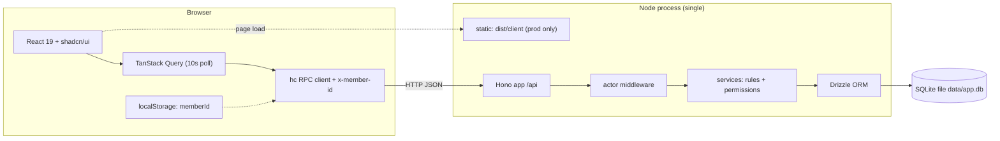
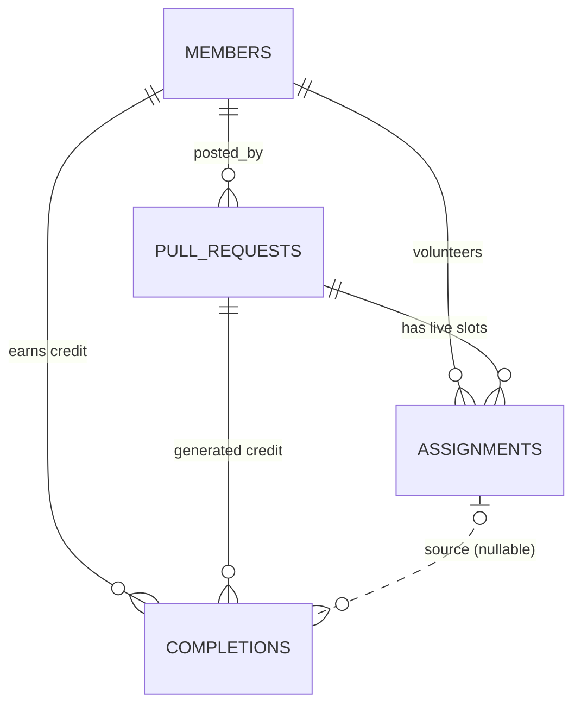
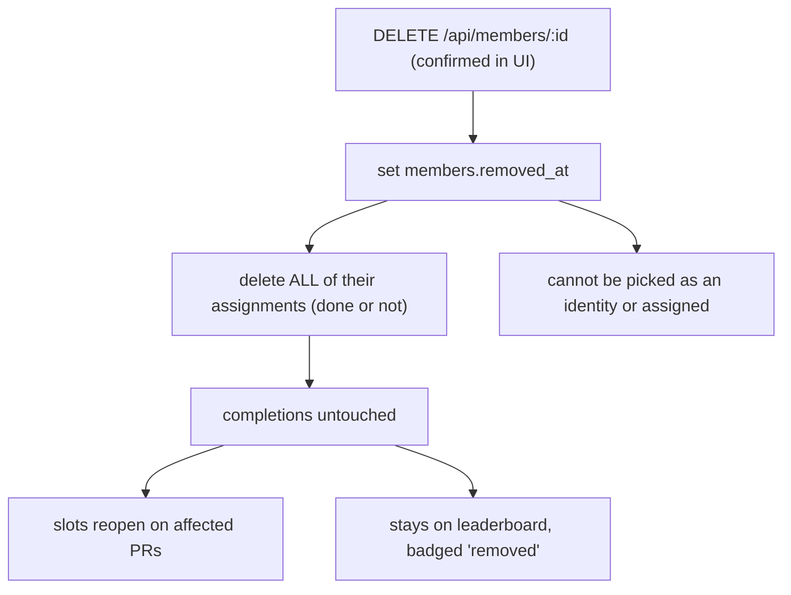

# Wechsel - Architecture

Companion to [product.md](product.md). This describes how the app is built and why.

## 1. Stack

- **Language:** TypeScript everywhere, `strict: true` (required for Hono's RPC type inference to work).
- **Runtime:** Node.js 22 LTS (local machine is on v22.23.1). Package manager: pnpm (10.6 available locally).
- **Backend:** [Hono](https://hono.dev) on `@hono/node-server`, with `@hono/zod-validator` for request validation.
- **Database:** SQLite via **Drizzle ORM** with the **`better-sqlite3`** driver. `drizzle-kit` generates and applies SQL migrations.
- **Frontend:** React 19 + Vite, **Tailwind CSS v4** (via `@tailwindcss/vite`) and **shadcn/ui** components.
- **Data fetching:** TanStack Query over Hono's `hc` RPC client, so the frontend gets end-to-end types with no code generation and no OpenAPI step.
- **Validation:** Zod schemas defined once in `src/shared` and used by both the server validators and the client forms.
- **Tests:** Vitest. Server tests drive the Hono app in-process via `app.request()` against a fresh in-memory database.

### Why these choices

- **`better-sqlite3` over `node:sqlite`.** Node 22 ships `node:sqlite` and Drizzle has a `drizzle-orm/node-sqlite` driver, but `drizzle-kit` still expects `better-sqlite3` to connect for migration commands. Using `better-sqlite3` keeps one driver for both the app and the tooling. Its synchronous API is a good fit for SQLite's single-writer model.
- **Hono RPC over REST + hand-written types.** One `export type AppType = typeof routes` gives the client full request and response types. The cost is a discipline: **routes must be defined as a single chained expression**, because breaking the chain into separate statements loses the inferred types.
- **Polling over WebSockets.** A 10 second `refetchInterval` plus refetch-on-focus is a few lines of TanStack Query config, has no connection lifecycle to manage, and is invisible at this scale.
- **One process in production.** The built React bundle is served as static files by the same Hono server that serves `/api`, so deployment is "run one Node process next to one `.db` file".

## 2. Repository layout

A single package with three source roots. No monorepo: sharing types across pnpm workspace boundaries is the main source of Hono RPC type drift, and there is nothing here to publish.

```text
.
├── docs/                       product.md, architecture.md, implementation-plan.md
├── data/                       app.db (gitignored)
├── drizzle/                    generated SQL migrations + snapshots
├── src/
│   ├── shared/                 imported by BOTH client and server
│   │   ├── schemas.ts          zod request/response schemas
│   │   ├── types.ts            view models (PullRequestView, LeaderboardRow, ...)
│   │   └── github-url.ts       parse + canonicalise a GitHub PR URL
│   ├── server/
│   │   ├── index.ts            node-server bootstrap, static serving in prod
│   │   ├── app.ts              the single chained Hono app; exports AppType
│   │   ├── middleware/actor.ts resolves x-member-id into the acting member
│   │   ├── routes/             members.ts, pull-requests.ts, assignments.ts, leaderboard.ts
│   │   ├── services/           business rules + permission checks (pure-ish, testable)
│   │   ├── db/                 client.ts, schema.ts, migrate.ts, seed.ts
│   │   └── errors.ts           AppError + code -> HTTP status mapping
│   └── client/
│       ├── main.tsx, App.tsx
│       ├── index.css           tailwind + shadcn theme tokens
│       ├── lib/api.ts          hc<AppType> client, injects x-member-id
│       ├── lib/identity.ts     localStorage read/write for the current member
│       ├── hooks/              useMembers, usePullRequests, useLeaderboard, mutations
│       ├── components/ui/      shadcn generated components (do not hand-edit)
│       └── components/         IdentityGate, PostPrForm, PrList, PrCard, RoleTrack,
│                               MergedPrList, Leaderboard, TeamList, ConfirmDialog
├── components.json             shadcn config (css: src/client/index.css, alias @ -> src/client)
├── drizzle.config.ts
├── vite.config.ts              root: src/client, alias @ and @shared, /api proxy in dev
├── tsconfig.json / tsconfig.app.json / tsconfig.server.json
└── package.json
```

## 3. Runtime shape



In development Vite serves the UI on `5173` and proxies `/api` to the Hono server on `8787`, so the RPC base URL is just `/api` in both environments.

## 4. Data model



The load-bearing decision: **`assignments` is live and mutable, `completions` is an append-only ledger.** Product rules require that clearing an assignment or removing a member never destroys finished work, and that a cleared slot reopens. Separating the two makes that a structural guarantee instead of something every future `WHERE` clause has to remember.

_Alternative considered:_ a single `assignments` table with `released_at`/`superseded_at` lifecycle columns and no hard deletes. Fewer tables, but "current staffing" and "historical credit" then share one table and every query needs exactly the right combination of null checks - one missed filter silently corrupts the leaderboard.

### 4.1 Schema

```sql
CREATE TABLE members (
  id          TEXT PRIMARY KEY,          -- nanoid
  display_name TEXT NOT NULL,            -- as typed, trimmed
  name_key    TEXT NOT NULL UNIQUE,      -- lowercased, whitespace-collapsed
  created_at  INTEGER NOT NULL,          -- epoch ms
  removed_at  INTEGER                    -- NULL = active (soft delete)
);

CREATE TABLE pull_requests (
  id                 TEXT PRIMARY KEY,
  url                TEXT NOT NULL,      -- canonical .../pull/{n}
  owner              TEXT NOT NULL,
  repo               TEXT NOT NULL,
  number             INTEGER NOT NULL,
  note               TEXT,
  posted_by          TEXT NOT NULL REFERENCES members(id),
  reviewers_required INTEGER NOT NULL DEFAULT 1 CHECK (reviewers_required BETWEEN 0 AND 10),
  testers_required   INTEGER NOT NULL DEFAULT 0 CHECK (testers_required   BETWEEN 0 AND 10),
  merged_at          INTEGER,
  deleted_at         INTEGER,
  created_at         INTEGER NOT NULL,
  updated_at         INTEGER NOT NULL
);
-- one live post per URL; the same URL may be re-posted after deletion
CREATE UNIQUE INDEX pull_requests_live_url ON pull_requests (url) WHERE deleted_at IS NULL;

CREATE TABLE assignments (
  id              TEXT PRIMARY KEY,
  pull_request_id TEXT NOT NULL REFERENCES pull_requests(id) ON DELETE CASCADE,
  member_id       TEXT NOT NULL REFERENCES members(id),
  role            TEXT NOT NULL CHECK (role IN ('review','acceptance')),
  assigned_at     INTEGER NOT NULL,
  completed_at    INTEGER                -- NULL = still working
);
CREATE UNIQUE INDEX assignments_one_per_role ON assignments (pull_request_id, member_id, role);
CREATE INDEX assignments_by_pr ON assignments (pull_request_id);

CREATE TABLE completions (                -- append-only credit ledger
  id              TEXT PRIMARY KEY,
  pull_request_id TEXT NOT NULL REFERENCES pull_requests(id),
  member_id       TEXT NOT NULL REFERENCES members(id),
  role            TEXT NOT NULL CHECK (role IN ('review','acceptance')),
  assignment_id   TEXT REFERENCES assignments(id) ON DELETE SET NULL,
  completed_at    INTEGER NOT NULL
);
CREATE INDEX completions_by_member_role ON completions (member_id, role);
CREATE INDEX completions_by_pr ON completions (pull_request_id);
```

Notes:

- Members are **never** hard-deleted, which keeps every `posted_by` and `member_id` foreign key valid forever.
- `completions.assignment_id` is `ON DELETE SET NULL`: dropping an assignment leaves the credit intact but no longer linked. It exists so "Undo done" can delete exactly the credit that click created.
- Timestamps are epoch-millisecond integers, formatted client-side, avoiding all timezone and string-format questions.

### 4.2 Connection setup

On startup, before serving: `PRAGMA journal_mode = WAL`, `PRAGMA foreign_keys = ON`, `PRAGMA busy_timeout = 5000`, then run pending migrations. WAL matters because polling clients read constantly while someone writes.

### 4.3 Leaderboard query

Every active member appears (even with zero), removed members only if they earned credit, and credit on deleted PRs does not count:

```sql
SELECT m.id, m.display_name, m.removed_at,
       COUNT(CASE WHEN c.role = 'review'     AND p.id IS NOT NULL THEN 1 END) AS reviews_completed,
       COUNT(CASE WHEN c.role = 'acceptance' AND p.id IS NOT NULL THEN 1 END) AS tests_completed
FROM members m
LEFT JOIN completions c   ON c.member_id = m.id
LEFT JOIN pull_requests p ON p.id = c.pull_request_id AND p.deleted_at IS NULL
GROUP BY m.id
HAVING m.removed_at IS NULL OR reviews_completed + tests_completed > 0;
```

Ranks and the two orderings are applied in the service layer, which keeps ties (equal counts share a rank) out of SQL.

## 5. API surface

All routes under `/api`, all JSON, all defined in one chained expression in `src/server/app.ts`:

```ts
const routes = app
  .get('/api/members', ...)
  .post('/api/members', zValidator('json', createMemberSchema), ...)
  // ...
export type AppType = typeof routes
```

- `GET /api/members` - active members; `?includeRemoved=true` for the team list.
- `POST /api/members` `{ displayName }` - find-or-create by `name_key`; reactivates a removed match. Returns the member.
- `DELETE /api/members/:id` - soft delete, drop all their assignments, keep all credit.
- `GET /api/members/me` - validates the stored id; `404` tells the client to clear `localStorage` and show the identity gate.
- `GET /api/pull-requests` - `{ open: PullRequestView[], merged: PullRequestView[] }`, already sorted and with derived status.
- `POST /api/pull-requests` `{ url, reviewersRequired, testersRequired, note? }`.
- `PATCH /api/pull-requests/:id` `{ reviewersRequired?, testersRequired?, note? }` - poster only.
- `POST /api/pull-requests/:id/merge` and `DELETE /api/pull-requests/:id/merge` (undo) - any member.
- `DELETE /api/pull-requests/:id` - soft delete, any member.
- `POST /api/pull-requests/:id/assignments` `{ role }` - self-assign; rejects the poster; idempotent if already assigned.
- `DELETE /api/assignments/:assignmentId` - allowed for the assignee (remove me) or the PR poster (clear). Credit survives.
- `POST /api/assignments/:assignmentId/completion` - assignee marks done; writes an assignment row update **and** a `completions` row in one transaction.
- `DELETE /api/assignments/:assignmentId/completion` - assignee undoes a mistaken "done"; clears `completed_at` and deletes the linked credit row.
- `GET /api/leaderboard` - `{ reviews: LeaderboardRow[], acceptance: LeaderboardRow[] }`.

### 5.1 Actor and error handling

Every mutation carries the acting member as an `x-member-id` header, injected once by the `hc` client wrapper. The `actor` middleware loads that member, rejects unknown or removed ids with `401 unknown_member`, and puts the member on the context.

One error shape everywhere, produced by `app.onError` from a thrown `AppError`:

```json
{ "error": { "code": "not_poster", "message": "Only the person who posted this PR can change its requirements." } }
```

Codes: `unknown_member`, `name_taken`, `invalid_pr_url`, `duplicate_pr`, `not_found`, `not_poster`, `not_assignee`, `self_assign_forbidden`, `already_merged`, `validation_failed`. Messages are written for humans, because the client shows them directly in toasts. `zValidator` gets a hook so validation failures use the same envelope. Per Hono's guidance, handlers return explicit `c.json(..., status)` rather than `c.notFound()` so response types stay inferable.

## 6. Key flows

### 6.1 Volunteer, finish, and get cleared

```mermaid
sequenceDiagram
    participant R as Reviewer
    participant API as Hono /api
    participant DB as SQLite
    participant P as Poster
    R->>API: POST /pull-requests/:id/assignments {role:"review"}
    API->>DB: insert assignments (unique per pr+member+role)
    R->>API: POST /assignments/:aid/completion
    API->>DB: tx: set completed_at + insert completions
    Note over DB: credit is now permanent
    P->>API: DELETE /assignments/:aid  (PR changed, needs a fresh look)
    API->>DB: delete assignment; completions.assignment_id -> NULL
    Note over DB: slot reopens, reviewer keeps credit
```

### 6.2 Member removal



Any multi-statement operation like this runs inside a single `better-sqlite3` transaction.

## 7. Frontend architecture

- **Identity** lives in `localStorage` under one key (`wechsel.memberId`), read through `lib/identity.ts`. `App.tsx` renders `IdentityGate` when it is absent or when `GET /api/members/me` returns `404`.
- **Three query keys** only: `['members']`, `['pull-requests']`, `['leaderboard']`, each with `refetchInterval: 10_000` and `refetchOnWindowFocus: true`. Background refetching pauses when the tab is hidden.
- **Mutations** invalidate the keys they affect; anything that changes credit invalidates both `['pull-requests']` and `['leaderboard']`. Assign and mark-done additionally get optimistic updates so the buttons feel instant.
- **Derived state is computed on the server** and shipped in `PullRequestView`. The client renders; it does not recompute status or progress. This keeps one implementation of the rules.
- **Destructive actions** (delete PR, remove member) use one shared `ConfirmDialog` built on shadcn's `alert-dialog`, which names the specific target and describes the consequence. Cancel holds initial focus.
- **shadcn components** used: `button`, `input`, `label`, `card`, `badge`, `alert-dialog`, `dialog`, `command`, `popover`, `select`, `tabs`, `collapsible`, `separator`, `skeleton`, `tooltip`, `sonner`. Generated files in `components/ui/` are left unmodified so the CLI can update them.
- **Feedback:** every mutation error surfaces as a `sonner` toast using the server's human-readable message; loading states use skeletons on first load only, never on background polls.

## 8. Validation

`src/shared/schemas.ts` is the single source of truth, consumed by `zValidator` on the server and by the same forms on the client:

- `displayName`: trimmed, 1-40 chars, must contain a non-whitespace character.
- `url`: passes `parseGitHubPrUrl`, which accepts `http`/`https`, optional `www.`, and trailing segments like `/files` or query strings, and returns `{ owner, repo, number, canonicalUrl }`.
- `reviewersRequired` / `testersRequired`: integer 0-10.
- `note`: optional, max 200 chars.
- `role`: `'review' | 'acceptance'`.

## 9. Configuration

- `PORT` (default `8787`), `DB_FILE` (default `./data/app.db`), `NODE_ENV`.
- No secrets, so no `.env` is required to run; a `.env.example` documents the two knobs.

## 10. Build and run

- `pnpm dev` - Vite on 5173 and `tsx watch` on the server, concurrently.
- `pnpm db:generate` / `pnpm db:migrate` / `pnpm db:seed` - drizzle-kit plus a seed script with a few members and PRs.
- `pnpm build` - `vite build` to `dist/client` and `tsc -p tsconfig.server.json` to `dist/server`.
- `pnpm start` - runs migrations, then serves `/api` and `dist/client` from one process.
- `pnpm test`, `pnpm lint`, `pnpm typecheck`.

In production the server mounts `serveStatic` for `dist/client` and falls back to `index.html` for unknown non-`/api` paths.

## 11. Testing strategy

- **Service and route tests (the bulk).** Vitest with a fresh `:memory:` database per test file, migrations applied in `beforeEach`, exercised through `app.request()`. These cover the rules that matter: poster cannot self-assign; clearing an assignment preserves credit; removing a member drops assignments and preserves credit; leaderboard excludes deleted PRs; duplicate URL rejected; requirement changes are poster-only; undo-done removes exactly one credit row.
- **Unit tests** for `parseGitHubPrUrl` (valid forms, weird suffixes, non-PR URLs) and for the status/ranking derivation.
- **Component tests** for `IdentityGate` and `PrCard` permission rendering with Testing Library.
- **Manual smoke checklist** per phase, in [implementation-plan.md](implementation-plan.md); two browser profiles side by side to verify polling.

## 12. Security posture

State it plainly: there is **no authentication**. Anyone who can reach the app can act as anyone, delete any PR post, or remove any member. That is acceptable only because it is an internal tool on a trusted network, and it is what the confirmed identity decision asks for. Mitigations that are in scope: destructive actions require confirmation, nothing is truly destroyed at the database level (soft deletes plus an append-only ledger), and the database is one file that is trivial to back up. If it ever needs to face the internet, the migration path is to put real sessions behind the existing `actor` middleware - the one place identity is resolved.
