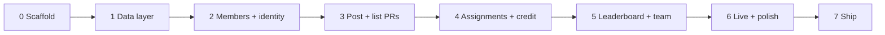

# Wechsel - Phased Implementation Plan

Seven phases, each ending in something demonstrable. Requirements come from [product.md](product.md); structure and naming come from [architecture.md](architecture.md).

Ground rules for every phase:

- Shared Zod schemas and types land in `src/shared` **before** the server or client code that uses them.
- Business rules and permission checks live in `src/server/services`, never in route handlers or React components.
- Routes are appended to the one chained Hono expression in `src/server/app.ts`; breaking the chain breaks client types.
- A phase is done when `pnpm typecheck`, `pnpm test`, and its manual checklist all pass.

---

## Phase 0 - Scaffold and one working request

**Goal:** an empty but complete skeleton where a React page fetches from Hono.

- `git init`, pnpm project, `.gitignore` (`node_modules`, `dist`, `data/*.db*`).
- Vite React + TS, Tailwind v4 via `@tailwindcss/vite`, `@` alias to `src/client`, `@shared` alias to `src/shared`.
- `pnpm dlx shadcn@latest init`, with `components.json` pointing at `src/client/index.css`; add `button` and `card` to prove it works.
- Hono app with `GET /api/health`, `@hono/node-server` on `8787`, `tsx watch`.
- Vite dev proxy `/api` -> `http://localhost:8787`; `pnpm dev` runs both.
- `tsconfig.json` split (app/server), `strict: true` in both. Vitest, ESLint, Prettier.
- Skeleton `README.md` with the commands.

**Done when:** `pnpm dev` shows a styled shadcn page displaying `ok` from `/api/health`, and `pnpm typecheck`/`pnpm test` pass on an empty suite.

**Risk to check here, not later:** the shadcn CLI and Tailwind v4 must agree on the CSS entry path, and the RPC `hc<AppType>` import must resolve from client to server source. Verify both now with one trivial typed route.

---

## Phase 1 - Data layer

**Goal:** the schema from the architecture doc exists, migrates, and seeds.

- `src/server/db/schema.ts`: `members`, `pull_requests`, `assignments`, `completions` with all indexes, checks, and the partial unique index on live PR URLs.
- `src/server/db/client.ts`: `better-sqlite3` + Drizzle, with `journal_mode=WAL`, `foreign_keys=ON`, `busy_timeout=5000`.
- `drizzle.config.ts`; generate the first migration; `migrate.ts` runs pending migrations at startup.
- `src/shared/github-url.ts` plus its unit tests - do this first, it is pure and cheap.
- `db:seed` script: 4 members, 3 PRs, a mix of assignments and credit.
- Test helper that spins up a migrated `:memory:` database per test file.

**Done when:** `pnpm db:migrate && pnpm db:seed` produces a populated `data/app.db`, the partial unique index actually rejects a duplicate live URL, and the URL parser tests pass.

---

## Phase 2 - Members and identity

**Goal:** you can become someone, and stop being them.

- `src/shared/schemas.ts`: `createMemberSchema` (name normalisation to `name_key`).
- `services/members.ts`: `listMembers`, `findOrCreate` (reactivates a removed name match), `removeMember` (transaction: set `removed_at`, delete all their assignments, leave `completions`).
- Routes: `GET /api/members`, `POST /api/members`, `GET /api/members/me`, `DELETE /api/members/:id`.
- `middleware/actor.ts` + `errors.ts` + `app.onError` with the shared error envelope.
- Client: `lib/api.ts` (`hc<AppType>` injecting `x-member-id`), `lib/identity.ts`, `IdentityGate` (shadcn `command` combobox over existing names plus free-text create), header with current identity and "Switch user".
- `App.tsx` gate: no stored id, or `me` returns 404 -> identity card.

**Tests:** creating an existing name returns the same member; case and whitespace variants collide; re-adding a removed name reactivates it; unknown `x-member-id` gives `401 unknown_member`.

**Done when:** a fresh browser profile is forced to pick a name, a reload skips the gate, "Switch user" works, and removing the member you are logged in as bounces you back to the gate.

---

## Phase 3 - Post and list PRs

**Goal:** the PR board exists, minus volunteering.

- Schemas: `createPullRequestSchema`, `updatePullRequestSchema`.
- `services/pull-requests.ts`: create (parse + canonicalise + duplicate check), update requirements (poster only), merge and undo-merge, soft delete, and the list builder that produces `PullRequestView` with derived status and the documented ordering.
- Routes: `GET/POST /api/pull-requests`, `PATCH /api/pull-requests/:id`, `POST`/`DELETE /api/pull-requests/:id/merge`, `DELETE /api/pull-requests/:id`.
- Client: `PostPrForm` with inline validation; `PrCard` showing repo link, note, poster, relative time, status badge; poster-only requirement steppers; `MergedPrList` in a `collapsible`; `ConfirmDialog` wired to delete.
- Empty states for "no open PRs" and "nothing merged yet".

**Tests:** invalid URL rejected; duplicate live URL rejected; the same URL accepted after deletion; non-poster gets `not_poster` on `PATCH`; merged PRs leave `open` and appear in `merged`; ordering puts unfilled-and-oldest first.

**Done when:** you can post a PR, edit its requirements only as its poster, merge and un-merge it, and delete it only after confirming.

---

## Phase 4 - Assignments and completion credit

**Goal:** the heart of the app - and the phase where the rules must be exactly right.

- `services/assignments.ts`:
  - `assign` - active member, not the poster (`self_assign_forbidden`), idempotent if the row already exists, extra volunteers allowed.
  - `unassign` - allowed for the assignee or the PR's poster; deletes the assignment; `completions` untouched, so `assignment_id` becomes `NULL`.
  - `complete` - assignee only; one transaction sets `completed_at` and inserts the credit row.
  - `undoComplete` - assignee only; clears `completed_at` and deletes the credit row linked to that assignment.
- Routes: `POST /api/pull-requests/:id/assignments`, `DELETE /api/assignments/:id`, `POST`/`DELETE /api/assignments/:id/completion`.
- Client: `RoleTrack` renders `done/required`, an assignee chip per person with a done check, and only the actions the viewer may perform; `not needed` when the requirement is 0.

**Tests (the highest-value suite in the project):** poster cannot self-assign either role; a non-poster can hold both roles; double-assign is idempotent; remove-after-done keeps credit; poster clearing a completed assignment keeps credit and reopens the slot; undo-done removes exactly one credit row; a third volunteer on a 2-slot track is accepted and their credit counts; a stranger cannot complete someone else's assignment.

**Done when:** two browser profiles can volunteer, finish, clear, and un-volunteer against the same PR, with statuses updating correctly and no credit ever lost except by explicit undo.

---

## Phase 5 - Leaderboard and team management

**Goal:** the work becomes visible.

- `services/leaderboard.ts`: the documented SQL, plus rank assignment with shared ranks for ties and the `count desc, name asc` ordering.
- `GET /api/leaderboard`.
- Client: two ranked lists (reviews, acceptance tests), zero-count active members included, removed members shown only with credit and badged, current user's row highlighted.
- `TeamList` with a per-member remove action behind `ConfirmDialog`.

**Tests:** members with no credit appear with 0; removed-with-credit appears, removed-without-credit does not; credit on a deleted PR is excluded; credit on a merged PR is included; ties share a rank.

**Done when:** completing work in phase 4 immediately moves someone up the board, and removing a member keeps their totals while emptying their live assignments.

---

## Phase 6 - Live updates and polish

**Goal:** it stops feeling like a prototype.

- TanStack Query defaults: `refetchInterval: 10_000`, `refetchOnWindowFocus`, no background refetch when hidden; "updated Xs ago" in the header.
- Optimistic updates for assign and mark-done, with rollback and a toast on failure.
- `sonner` toasts on every mutation, using the server's human-readable message.
- Skeletons on first load only; no flicker on polls.
- Responsive pass at 375px, dark mode via OS preference with a header override (system/light/dark), keyboard and focus pass, `aria-live` on the freshness indicator, status conveyed by text as well as colour.
- Component tests for `IdentityGate` and `PrCard` permission rendering.

**Done when:** an action in one browser profile appears in another within ~10 seconds without a refresh, and the manual accessibility and mobile checklists pass.

---

## Phase 7 - Ship

**Goal:** someone else can run it.

- `pnpm build` (client to `dist/client`, server to `dist/server`); production static serving with SPA fallback for non-`/api` routes.
- `pnpm start` runs migrations before listening.
- `README.md`: what it is, the no-auth warning, setup, the scripts table, where the database file lives, how to back it up (copy `data/app.db*`), and how to restore.
- A `Dockerfile` with the database on a mounted volume, and a systemd/pm2 note for a small internal box.

**Done when:** a clean clone reaches a working app with `pnpm install && pnpm build && pnpm start`, on an empty database, following only the README.

---

## Suggested checkpoints

Phases 0-1 are plumbing and can run together in one sitting. Stop for review after **phase 2** (identity feels right?), after **phase 4** (the rules are the product - review these tests specifically), and after **phase 6** (does the team actually want to use it?).

## Deliberately deferred

Everything in [product.md section 11](product.md#11-future-enhancements-roughly-in-order-of-value): "My assignments" strip, GitHub API enrichment, Slack notifications, aging highlights, time-windowed leaderboards, and an audit log UI. The append-only `completions` ledger is what makes that last one easy later.
